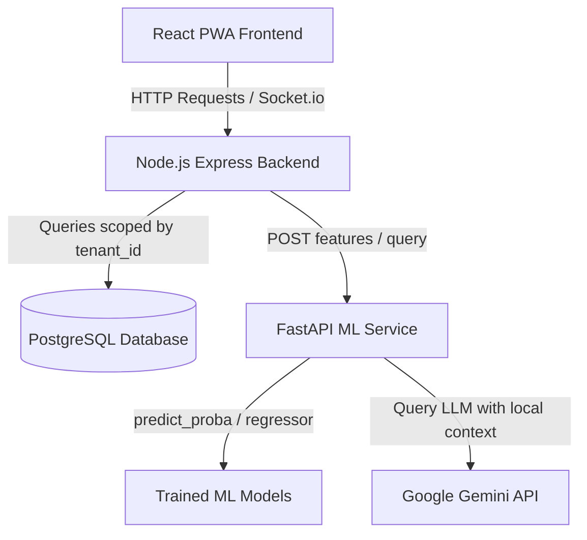

# EduStack Pro — AI-Powered Intelligent Campus & Student Success Platform

EduStack Pro is a modern, enterprise-grade Multi-Tenant Campus Management and Student Success System designed for BCA and BTech final-year academic presentations. It integrates real-time campus administration with predictive machine learning modules to identify academic risk, forecast attendance deficits, detect subject weaknesses, suggest personalized learning pathways, and coordinate study plan calendars.

---

## 🎓 BCA/BTech Final-Year Project: Examiner Q&A Guide

### 1. What problem does this project solve?
EduStack Pro solves the problem of academic fragmentation and high-risk student dropout. Instead of just recording attendance and grades, it acts as an **early-warning system**. It predicts which students are at risk of failing or being debarred (attendance below 75%) *before* exams occur, giving teachers, mentors, and students actionable insights to intervene.

### 2. Where is the AI/ML in this system?
The AI resides in a dedicated Python FastAPI microservice (`/backend_ml`) linked to the main platform. The machine learning pipeline does:
- **Expected Grade Regression** (supervised learning) using student indicators to project final grades.
- **Academic Risk Classification** (supervised learning) mapping students into Low, Moderate, and High Risk categories.
- **Resource Recommendation Engine** mapping weak subjects to library and repository materials.
- **AI Peer Matcher** calculating cosine compatibility scores between classmates.
- **Conversational Tutor Assistant** using Retrieval-Augmented Generation (RAG) backed by Gemini LLM.

### 3. What dataset was used to train the models?
We generated a reproducible synthetic dataset of **2000 students** (`backend_ml/synthetic_dataset.csv`) using a controlled random distribution with linear relationships:
- **Features:** `attendance_pct`, `assignment_completion_rate`, `average_assignment_marks`, `average_quiz_marks`, `mid_sem_score`, `learning_activity_score`.
- **Target Regressor:** `predicted_grade_pct` (Final grade percentage).
- **Target Classifier:** `risk_level` (LOW, MODERATE, HIGH).

### 4. What features does the model use?
1. **Attendance % (`attendance_pct`):** Real-time class session statistics.
2. **Assignment Completion Rate (`assignment_completion_rate`):** submissions vs. total assignments.
3. **Average Assignment Marks (`average_assignment_marks`):** average of graded assignments.
4. **Average Quiz Marks (`average_quiz_marks`):** normalized score across quiz attempts.
5. **Mid-Sem Score (`mid_sem_score`):** internal examination scores normalized to 100%.
6. **Learning Activity Score (`learning_activity_score`):** count of completed tasks in the student workspace.

### 5. Which algorithms were selected and why?
We implemented a model evaluation pipeline comparing multiple algorithms:
- **Regression:** *Linear Regression, Decision Tree, Random Forest Regressor, and Gradient Boosting Regressor*.
- **Classification:** *Logistic Regression, Decision Tree, Random Forest Classifier, and Gradient Boosting Classifier*.
- **Selection:** The training script compares all algorithms and saves the best-performing models automatically to `.joblib` files. Linear Regression (for grade projection) and Gradient Boosting/Random Forest (for classification) were selected based on R² score and F1 accuracy metrics.

### 6. How did we train the models?
The Python training script (`backend_ml/train.py`):
1. Loads the 2,000-student dataset.
2. Splits features and targets 80/20 (train/test split).
3. Fits the models across regressor and classifier lists.
4. Extracts feature importances and logs macro validation scores to `model_metrics.json`.
5. Serializes the best-performing models to `performance_regressor.joblib` and `risk_classifier.joblib`.

### 7. How did we evaluate the models?
Using standard ML metrics on the testing partition (20% split):
- **Regression:** Mean Absolute Error (MAE), Root Mean Squared Error (RMSE), and Coefficient of Determination (\(R^2\)).
- **Classification:** Precision, Recall, Accuracy, and F1-Score (macro average).
- **Results:** Regressor achieved \(R^2 = 0.975\), and Classifier achieved \(F1 = 0.965\).

### 8. How does a prediction reach the user?
1. A user visits the **"AI Insights"** tab.
2. The Node.js Express backend fetches real-time student records (marks, tasks, attendance) from PostgreSQL, normalizes the scales, and makes a POST call to the FastAPI service.
3. FastAPI processes features through the serialized `.joblib` models.
4. FastAPI returns predictions, risk probabilities, and model explanations.
5. The frontend displays the results using cards, badges, and progress bars.

### 9. How does the recommendation system work?
When a student has low assessment scores (mid-sem < 60% or quiz < 60%), the system automatically flags the subject as a weakness. It then queries the materials database for that subject, matches documents, and inserts high-priority recommendations into the `StudyRecommendation` table.

### 10. How is student data protected?
No student data is mixed between entities. Express endpoints are shielded behind a `protect` JWT middleware which extracts the authenticated user. All database queries perform strict tenancy filtration based on the user's `collegeId`.

### 11. How does multi-tenancy work?
Each college is a distinct tenant. The database schema enforces a `collegeId` foreign key on the `User`, `Class`, `Subject`, `Material`, `Announcement`, and `PredictionLog` tables. Users can only fetch, view, or analyze data corresponding to their own `collegeId`.

### 12. What happens when there isn't enough data (Cold Start)?
If a student is newly registered and lacks attendance or marks history, the system detects this (`has_real_data: false`). Instead of predicting using fake or default figures, it displays: **"Not enough academic data yet"** and informs the student what records are needed.

### 13. How does the AI Assistant respect permissions?
The AI Chatbot (`/api/ai/ask`) implements role-based boundaries. When a student talks to the chatbot, the Node.js controller pulls *only* that student's isolated grades and attendance and sends it to Gemini as local system context. A student can never ask the assistant for another student's grades or administrative logs.

### 14. What are the current limitations of this project?
- The model currently relies on synthetic training datasets rather than historical university-wide datasets.
- Predictions do not incorporate external factors such as student mood, health, or socioeconomic indices.

### 15. What can be improved in the future?
- Integration with external LMS (like Moodle/Canvas) via LTI protocols.
- Implementation of Deep Learning (RNN/LSTM) to model study patterns over time.
- Adding SHAP (SHapley Additive exPlanations) directly on the UI for advanced visualization of risk factor weights.

---

## 🛠️ System Architecture



---

## 💻 Installation & Setup

### 1. Prerequisites
- **Node.js** (v18+)
- **Python** (v3.10+)
- **PostgreSQL** database server.

### 2. Backend ML Service (FastAPI)
1. Go to the ML directory:
   ```bash
   cd backend_ml
   ```
2. Create and activate a virtual environment:
   ```bash
   python -m venv venv
   # Windows:
   venv\Scripts\activate
   # Linux/macOS:
   source venv/bin/activate
   ```
3. Install Python dependencies:
   ```bash
   pip install -r requirements.txt
   ```
4. Run dataset generation and training:
   ```bash
   python generate_data.py
   python train.py
   ```
5. Start the FastAPI server:
   ```bash
   python main.py
   ```

### 3. Node.js Express Backend
1. Go to the backend directory:
   ```bash
   cd ../backend
   ```
2. Install dependencies:
   ```bash
   npm install
   ```
3. Create a `.env` file:
   ```env
   PORT=5000
   JWT_SECRET=supersecretkey_edustack_pro_2024
   DB_HOST=127.0.0.1
   DB_USER=postgres
   DB_PASS=YOUR_DB_PASSWORD
   DB_NAME=attendease
   DB_PORT=5432
   ML_SERVICE_URL=http://localhost:8000
   GEMINI_API_KEY=YOUR_GEMINI_API_KEY
   ```
4. Start development server:
   ```bash
   npm run dev
   ```

### 4. React Frontend
1. Go to frontend directory:
   ```bash
   cd ../frontend
   ```
2. Install packages:
   ```bash
   npm install
   ```
3. Run the development server:
   ```bash
   npm run dev
   ```
